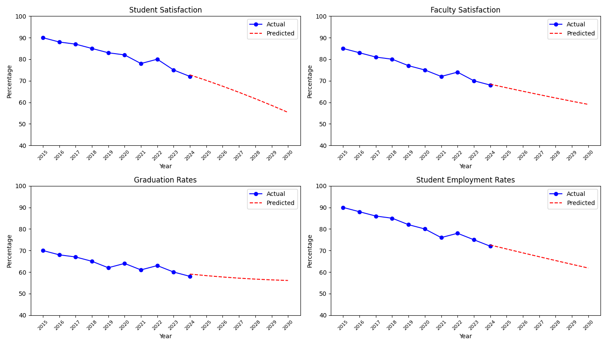

# Menlo College KPI Predictions

This school project aims to make KPI (Key Performance Indicator) predictions for Menlo College using a blend of hypothetical (per assignment instructions) and real data. The predictions cover various metrics such as student satisfaction, faculty satisfaction, graduation rates, and student employment rates.

## Project Description

The project uses polynomial regression models to predict the trends of key performance indicators for Menlo College from 2015 to 2030. The data includes historical values from 2015 to 2024 and predictions from 2025 to 2030.

The following KPIs are analyzed:
- Student Satisfaction
- Faculty Satisfaction
- Graduation Rates
- Student Employment Rates

## Graphs

The graphs below show the actual and predicted values for each KPI:



## Usage

To generate the predictions and graphs, run the `data.py` script (make any changes to the baseline data if you would like to use your own data):

```bash
python data.py
```

## Dependencies

The project requires the following Python packages:
- matplotlib
- numpy
- scikit-learn

You can install the dependencies using the following command:

```bash
pip install -r requirements.txt
```

## Workflow

A GitHub Actions workflow is set up to automatically run the script and generate the graphs. The workflow can be manually triggered from the "Actions" tab in this repository.
